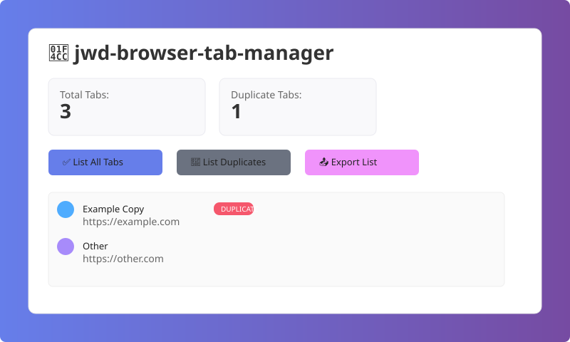
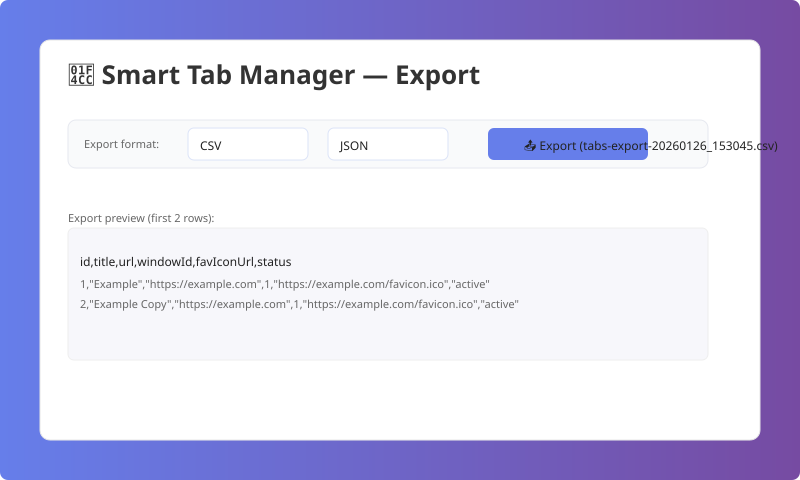

# 📌 jwd-browser-tab-manager

A powerful Chrome Extension (Manifest V3) that helps you efficiently manage open tabs, detect and handle duplicate tabs, and organize your browsing experience.

## Features

- **Tab Statistics**: View total number of open tabs and duplicate tabs at a glance
- **List All Tabs**: See all your open tabs with duplicate indicators
- **Close Duplicate Tabs**: Automatically detect and close duplicate tabs with one click
- **Group Tabs by Domain**: Organize tabs by their domain names into tab groups
- **Close Tabs Except Active**: Quickly close all tabs except the one you're currently viewing

- **Export Lists (CSV / JSON)**: Export the currently shown list (All or Duplicates) as a timestamped CSV or JSON file. Exports include `id`, `title`, `url`, `windowId`, `favIconUrl`, and `status` fields.

## Installation

### Install from Source

1. Clone this repository or download the source code
   ```bash
   git clone https://github.com/ApiCartOps/jwd-browser-tab-manager.git
   cd jwd-browser-tab-manager
   ```

2. Open Chrome and navigate to `chrome://extensions/`

3. Enable "Developer mode" by toggling the switch in the top right corner

4. Click "Load unpacked" button

5. Select the directory containing the extension files

6. The jwd-browser-tab-manager extension should now appear in your extensions list

## Usage

1. **Click the extension icon** in your Chrome toolbar to open the popup

2. **View Statistics**: The popup displays:
   - Total number of open tabs
   - Number of duplicate tabs detected

3. **Use the action buttons**:
   - **✅ List All Tabs**: Shows all open tabs with duplicate indicators
   - **✅ Close Duplicate Tabs**: Removes all duplicate tabs (keeps one copy of each)
   - **✅ Group Tabs by Domain**: Creates tab groups organized by domain
   - **✅ Close Tabs Except Active One**: Closes all tabs except your current tab

## Permissions

This extension requires the following permissions:
- `tabs`: To access and manage your browser tabs
- `tabGroups`: To create and manage tab groups
- `storage`: To store counts and state used by the background service worker

## Development

The extension is built with vanilla JavaScript and uses Manifest V3 for modern Chrome extension development.

### File Structure
```
chrome-duplicate-tabs/
├── manifest.json       # Extension manifest (V3)
├── popup.html         # Popup UI structure
├── popup.css          # Popup styling
├── popup.js           # Popup functionality
├── background.js     # Background service worker (optional runtime features)
└── icons/             # Extension icons
    ├── icon16.png
    ├── icon48.png
    └── icon128.png

## Testing

- Unit tests: Jest is configured (jsdom) — run `npm test`.
- E2E tests: Playwright tests are under `tests/playwright/`. Run `npx playwright test` or `npm run test:e2e` to execute browser tests (Chromium + Firefox projects are configured).

We added Playwright coverage for the popup UI including export behavior (`tests/playwright/export.spec.js`). The CI workflow runs Jest and Playwright on push/pull request to `main`.

## Notes / Tips

- Export filenames are timestamped like `tabs-export-YYYYMMDD_hhmmss.csv` or `.json`.
- The popup UI shows favicons (when available) and a small `status` badge next to tab titles.
- If you want a different export filename pattern or additional fields, open an issue or request the change.

## Screenshots

Popup (All Tabs view):



Export preview (CSV/JSON):


```

## License

MIT License

## Contributing

Contributions are welcome! Please feel free to submit a Pull Request.

## Cross-browser compatibility

- This extension uses the `webextension-polyfill` (included under `vendor/browser-polyfill.js`) and a small compatibility wrapper in `popup.js` so it can run on Chromium-based browsers and Firefox where possible.
- Firefox support: a `applications.gecko` entry has been added to `manifest.json` to provide an installable ID. Note that some Chrome-only APIs (for example `tabGroups`) may not be available in Firefox — those operations are guarded and will fail gracefully.
- To build for Firefox, consider using `web-ext` to lint and pack the extension:

```bash
npm install --global web-ext
web-ext build --source-dir .
```

If you want automated cross-browser packaging, I can add packaging scripts next.
